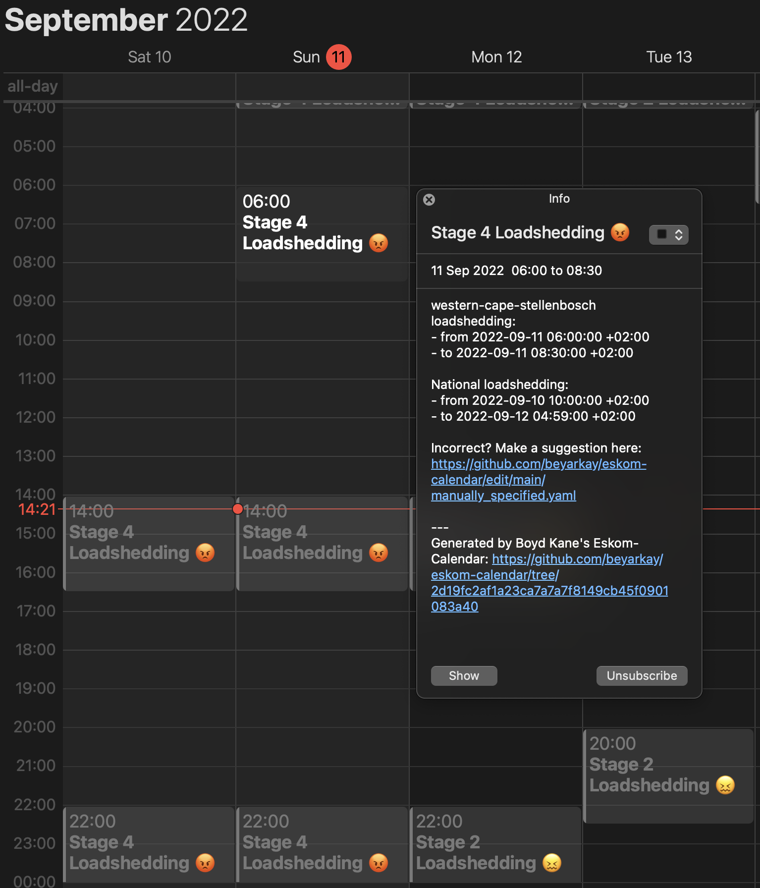

# Eskom Calendar 🔌 ⚡️

Sick and tired of complicated load shedding schedules? This project creates
up-to-date calendars that show you when load shedding is in your area.

To get your load shedding schedule in your calendar you should go to the
[latest release](https://github.com/beyarkay/eskom-calendar/releases/tag/latest) and
follow the instructions there.



## Similar apps
In the author's opinion, eskom-calendar is better than apps like EskomSePush,
because an event will only appear in your calendar if:
1. [Eskom's twitter feed](https://twitter.com/Eskom_SA) declares national loadshedding, and
2. Your area actually has loadshedding at that time, as defined by 
   [your eskom-defined area's loadshedding schedule](https://www.eskom.co.za/distribution/customer-service/outages/municipal-loadshedding-schedules/western-cape/).

What's more, eskom-calendar is open source! See below for how we keep it up to
date.

## Hey developers!

You can `curl` against the file
[`machine_friendly.csv`](https://github.com/beyarkay/eskom-calendar/releases/download/latest/machine_friendly.csv)
(found in the [latest
release](https://github.com/beyarkay/eskom-calendar/releases/tag/latest)) to
get the calendar data processed for whatever mad projects you can think of.
Here's a little cookbook of possibilities:

### Remind yourself what the header line of the CSV is

Note that the header is `finsh`, *not* `finish` (so that it lines up nicely
with `start`):
```sh
$ curl -sL https://github.com/beyarkay/eskom-calendar/releases/download/latest/machine_friendly.csv \
    | head -3
area_name,stage,start,finsh,source
free-state-seretse,4,2022-09-10T10:00:00+02:00,2022-09-10T12:30:00+02:00,"https://twitter.com/Eskom_SA/status/1568494585113976835"
free-state-seretse,4,2022-09-10T18:00:00+02:00,2022-09-10T20:30:00+02:00,"https://twitter.com/Eskom_SA/status/1568494585113976835"
```

### Get all data for a specific area
```sh
$ curl -sL https://github.com/beyarkay/eskom-calendar/releases/download/latest/machine_friendly.csv \
    | grep stellenbosch
western-cape-stellenbosch,4,2022-09-10T14:00:00+02:00,2022-09-10T16:30:00+02:00,"https://twitter.com/Eskom_SA/status/1568494585113976835"
western-cape-stellenbosch,4,2022-09-10T22:00:00+02:00,2022-09-11T00:30:00+02:00,"https://twitter.com/Eskom_SA/status/1568494585113976835"
western-cape-stellenbosch,4,2022-09-11T06:00:00+02:00,2022-09-11T08:30:00+02:00,"https://twitter.com/Eskom_SA/status/1568494585113976835"
western-cape-stellenbosch,4,2022-09-11T14:00:00+02:00,2022-09-11T16:30:00+02:00,"https://twitter.com/Eskom_SA/status/1568494585113976835"
western-cape-stellenbosch,4,2022-09-11T22:00:00+02:00,2022-09-12T00:30:00+02:00,"https://twitter.com/Eskom_SA/status/1568494585113976835"
western-cape-stellenbosch,3,2022-09-12T06:00:00+02:00,2022-09-12T08:30:00+02:00,"https://twitter.com/Eskom_SA/status/1568892284397051906"
western-cape-stellenbosch,3,2022-09-12T14:00:00+02:00,2022-09-12T16:30:00+02:00,"https://twitter.com/Eskom_SA/status/1568892284397051906"
western-cape-stellenbosch,3,2022-09-12T22:00:00+02:00,2022-09-13T00:30:00+02:00,"https://twitter.com/Eskom_SA/status/1568892284397051906"
western-cape-stellenbosch,2,2022-09-13T20:00:00+02:00,2022-09-13T22:30:00+02:00,"https://twitter.com/Eskom_SA/status/1568892284397051906"
western-cape-stellenbosch,2,2022-09-14T04:00:00+02:00,2022-09-14T06:30:00+02:00,"https://twitter.com/Eskom_SA/status/1568892284397051906"
western-cape-stellenbosch,2,2022-09-15T04:00:00+02:00,2022-09-15T06:30:00+02:00,"https://twitter.com/Eskom_SA/status/1568892284397051906"
western-cape-stellenbosch,2,2022-09-15T12:00:00+02:00,2022-09-15T14:30:00+02:00,"https://twitter.com/Eskom_SA/status/1568892284397051906"
western-cape-stellenbosch,2,2022-09-16T12:00:00+02:00,2022-09-16T14:30:00+02:00,"https://twitter.com/Eskom_SA/status/1568892284397051906"
western-cape-stellenbosch,2,2022-09-16T20:00:00+02:00,2022-09-16T22:30:00+02:00,"https://twitter.com/Eskom_SA/status/1568892284397051906"
```

### Get all data for a certain day in a certain area
```sh
$ curl -sL https://github.com/beyarkay/eskom-calendar/releases/download/latest/machine_friendly.csv \
    | grep cape-town-area-15 \
    | grep "2022-09-11"
city-of-cape-town-area-15,4,2022-09-11T00:00:00+02:00,2022-09-11T02:30:00+02:00,"https://twitter.com/Eskom_SA/status/1568494585113976835"
city-of-cape-town-area-15,4,2022-09-11T08:00:00+02:00,2022-09-11T10:30:00+02:00,"https://twitter.com/Eskom_SA/status/1568494585113976835"
city-of-cape-town-area-15,4,2022-09-11T16:00:00+02:00,2022-09-11T18:30:00+02:00,"https://twitter.com/Eskom_SA/status/1568494585113976835"
```

### Get just the start time, finish time, and stage for a certain area
```sh
$ curl -sL https://github.com/beyarkay/eskom-calendar/releases/download/latest/machine_friendly.csv \
    | grep city-power-13 \
    | cut -d, -f2,3,4
4,2022-09-11T12:00:00+02:00,2022-09-11T14:30:00+02:00
3,2022-09-13T02:00:00+02:00,2022-09-13T04:30:00+02:00
2,2022-09-13T10:00:00+02:00,2022-09-13T12:30:00+02:00
2,2022-09-14T18:00:00+02:00,2022-09-14T20:30:00+02:00
2,2022-09-16T02:00:00+02:00,2022-09-16T04:30:00+02:00
```

### See which areas are getting the least load shedding

```
$ curl -sL https://github.com/beyarkay/eskom-calendar/releases/download/latest/machine_friendly.csv \
    | tail -n +2 \
    | cut -d, -f1 \
    | sort \
    | uniq -c \
    | sort \
    | head
   4 city-power-11
   4 city-power-8
   4 city-power-9
   5 city-power-10
   5 city-power-12
   5 city-power-13
   5 city-power-14
   5 city-power-15
   5 city-power-16
   5 city-power-6
```

### Other ideas

Of course you can use your favourite language's requests library to download
the file yourself (it's almost always less than a megabyte) and parse the data
whichever which way you want. If you do something cool let us know via pull
request to this section!

## Contributing
The project is also open source! We depend on pull requests to update
[`manually_specified.yaml`](https://github.com/beyarkay/eskom-calendar/blob/main/manually_specified.yaml)
with the latest schedule. Please [edit and submit a PR to
`manually_specified.yaml`](https://github.com/beyarkay/eskom-calendar/edit/main/manually_specified.yaml)
if [Eskom's twitter feed](https://twitter.com/Eskom_SA) announces a change.

To add a new load shedding event, do the following:
1. Click [here](https://github.com/beyarkay/eskom-calendar/edit/main/manually_specified.yaml) to edit `manually_specified.yaml`.
    
   You'll see a bunch of `changes`. Each change lists one national load
   shedding event. It includes the stage, the start time, the end time, and the
   source. The source of a change explains where the information comes from,
   and should be a link to a tweet from the [official Eskom twitter
   account](https://twitter.com/Eskom_SA). It must be included or the calendars
   will not compile.
2. Add your changes to the list. For example:

```yaml
changes:
  # This is one change, indicating loadshedding stage 1 from 5am to 4pm on the
  # 18th of July 2022
  - stage: 1
    start: 2022-07-18T05:00:00     # Timestamp is +02:00 by default
    finsh: 2022-07-18T16:00:00     # Note that finish is spelt `finsh` so it lines up with `start`
    source: https://twitter.com/Eskom_SA/status/1547189452161916928?s=20&t=2MH_-k43RExp6ISPIpi-xw
  # This is another change, indicating loadshedding stage 2 from 4pm to
  # midnight on the 18th of July 2022
  - stage: 2
    start: 2022-07-18T16:00:00
    finsh: 2022-07-18T23:59:00
    source: https://twitter.com/Eskom_SA/status/1547189452161916928?s=20&t=2MH_-k43RExp6ISPIpi-xw
  ...
```

3. Once you've added your changes, scroll to the bottom where you see 
   `Propose changes` and add a commit message. The commit body must include the
   source where you got your information from.
4. Click the green button `Propose changes`
5. Check that your changes look good, and then click the button `Create pull request`

That's it! I'll review the PR and when I merge it, the calendars will
automatically be updated by GitHub actions.

